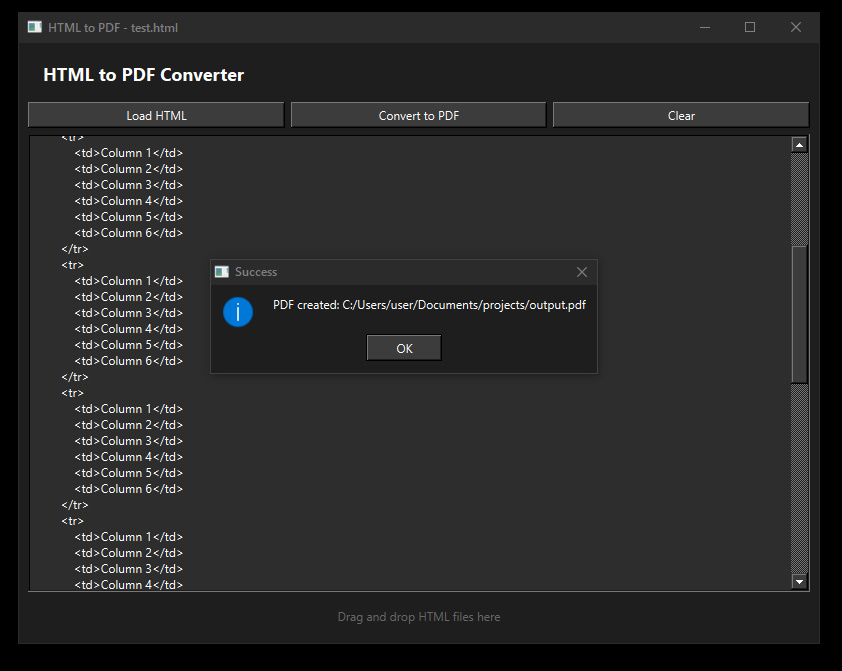
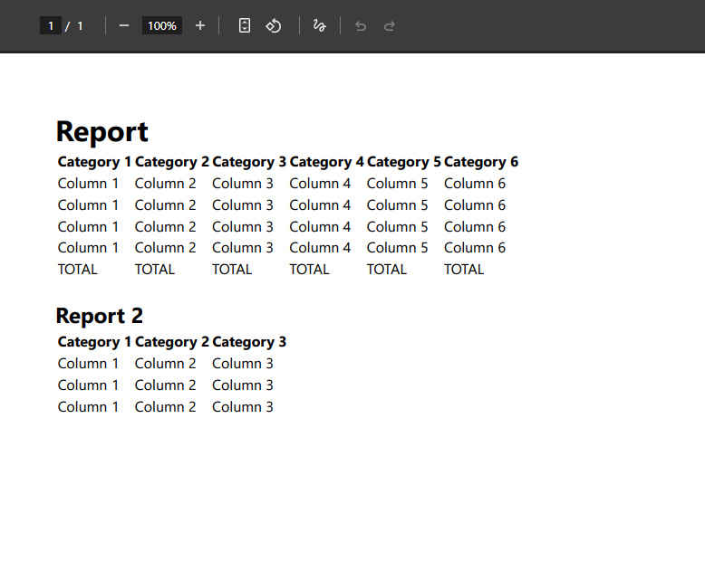

# html2pdf

  
  
  

## Простой html-pdf конвертер

## С++, framework - Qt (версия 6.9.3)

## Без использования WebEngine (Работа только с базовым html, при желании можно расширить)

## Интуитивно понятный gui

